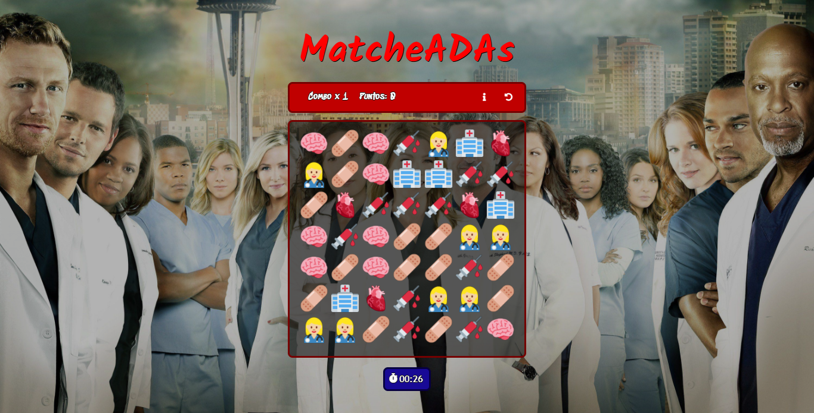

# *Grey's* *MatcheADAs* 👩🏼‍⚕️
Juego cuyo objetivo es encontrar coincidencias de 3 o mas figuras para acumular puntos, en un periodo de tiempo determinado.
Proyecto realizado como evaluación final del cuarto modulo del curso desarrollo FrontEnd ADA, utilizando **JavaScript**, **HTML** y **CSS**.

## 🩹 Haciendo click [aquí](https://maricaroj.github.io/proyecto-matche-adas/) puedes jugarlo 🎮

 

🏥 ***Este proyecto utiliza las siguientes dependencias:*** 

📁 [SweetAlert](https://sweetalert.js.org/)
 

📁  [Twemoji](https://twemoji.twitter.com/)

---
Hecho con mucho amor por [Mí](https://github.com/maricaroj)💛💙❤️